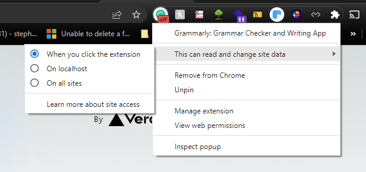

# Stephen's Note

## Grammerly Extension Issue

```
app-index.js:32 Warning: Extra attributes from the server: data-new-gr-c-s-check-loaded,data-gr-ext-installed,data-gr-ext-disabled

Fix: Change "This can read and change site data"
change to as you see in image, change back later for use.


```
